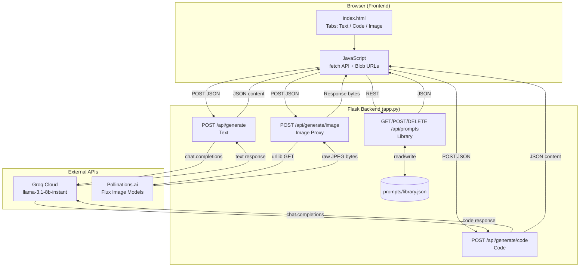
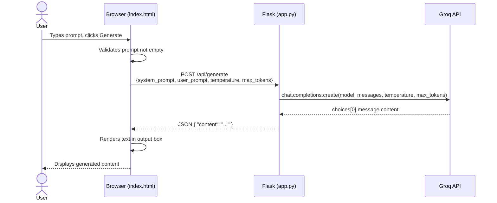
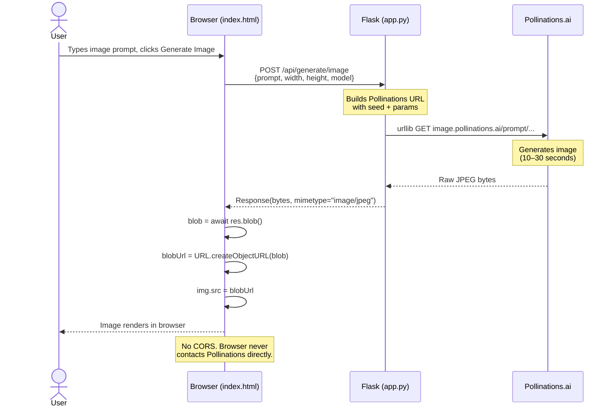
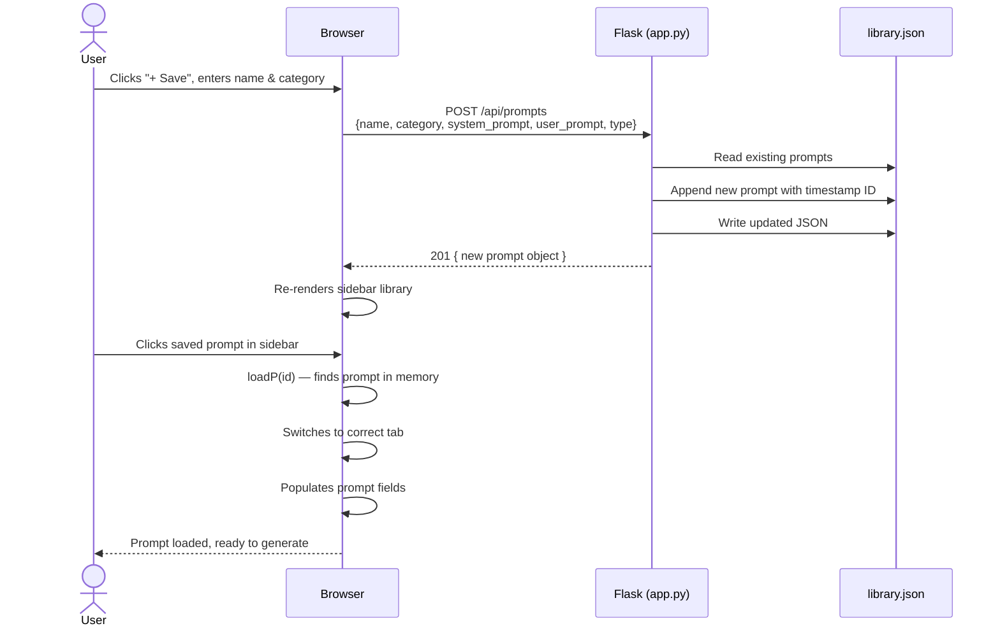
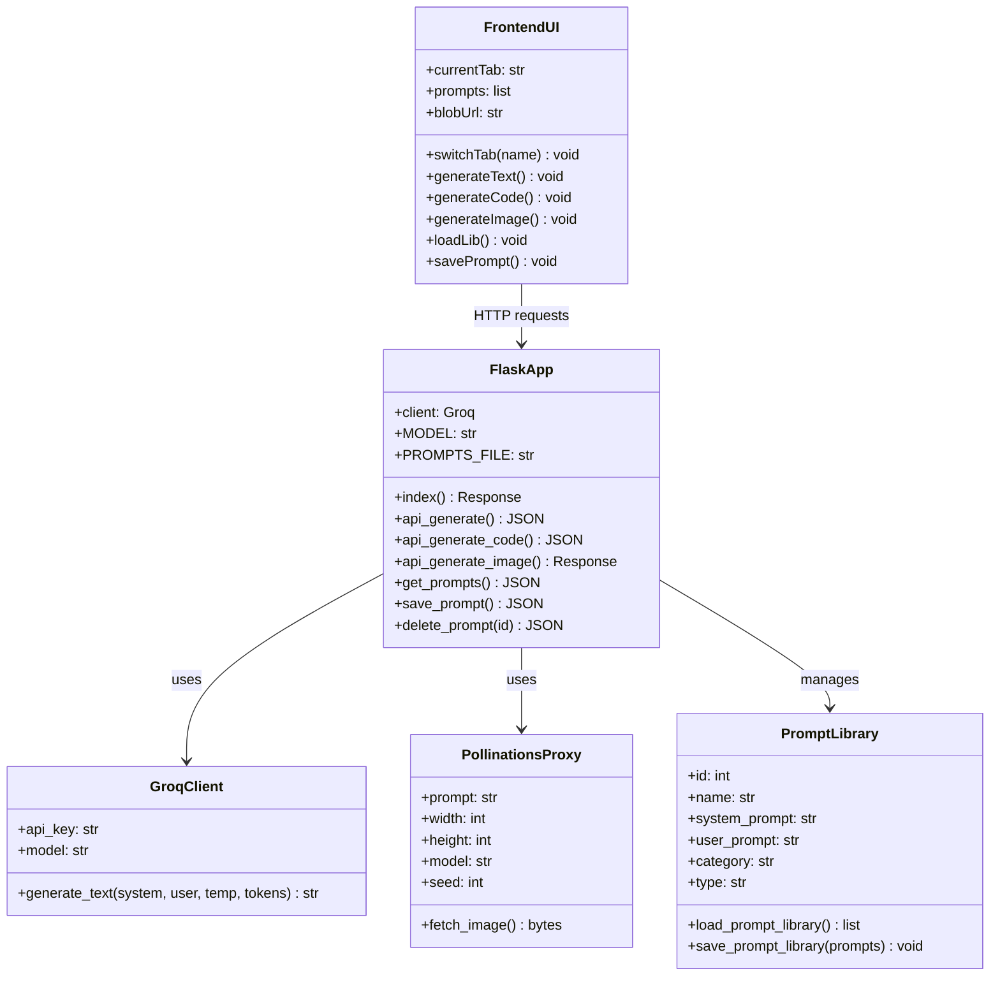
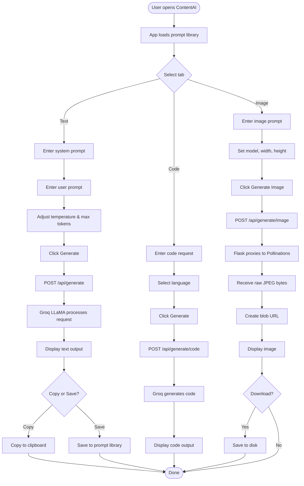

# ContentAI — AI Content Generator
open in your browser:https://generative-ai-1l0y.onrender.com/
> **Text · Code · Images** — powered by Groq LLaMA 3.1 and Pollinations.ai

ContentAI is a production-ready Flask web application that lets you generate text, code, and images through a single, polished interface. It features a persistent prompt library, configurable generation parameters, and a server-side image proxy that eliminates browser CORS issues entirely.

---

## Table of Contents

1. [Project Overview](#project-overview)
2. [SDLC Methodology — Agile Approach](#sdlc-methodology--agile-approach)
3. [UML Diagrams](#uml-diagrams)
4. [Project Structure](#project-structure)
5. [Features](#features)
6. [Installation](#installation)
7. [Usage](#usage)
8. [API Endpoints](#api-endpoints)
9. [Testing](#testing)
10. [AI Configuration](#ai-configuration)
11. [How the Image Proxy Works](#how-the-image-proxy-works)
12. [Future Enhancements](#future-enhancements)
13. [Tech Stack](#tech-stack)
14. [Acknowledgements](#acknowledgements)

---

## Project Overview

ContentAI was built to solve a common pain point: switching between multiple AI tools to generate text, code, and images. By combining Groq's ultra-fast LLaMA inference with Pollinations.ai's free image generation, ContentAI delivers a unified, single-tab creative workspace — no subscriptions, no fragmented tools.

**Key problem solved:** Browser CORS restrictions prevent direct image API calls from the frontend. ContentAI's server-side image proxy (Flask fetches and streams raw bytes) eliminates this entirely.

---

## SDLC Methodology — Agile Approach

ContentAI was developed using an **Agile SDLC methodology**, broken into short iterative sprints with working deliverables at the end of each cycle.

### Why Agile?

Traditional waterfall development would have locked in requirements upfront — but this project evolved based on real testing feedback (e.g. the image CORS bug only emerged during Sprint 3 testing). Agile allowed us to discover, adapt, and fix without restarting.

---

### Sprint Overview

| Sprint | Duration | Goal | Outcome |
|--------|----------|------|---------|
| **Sprint 1** | Week 1 | Backend scaffolding | Flask app running, Groq text generation working |
| **Sprint 2** | Week 1–2 | Code generation + UI | Code tab functional, prompt library CRUD complete |
| **Sprint 3** | Week 2 | Image generation | Pollinations integration; CORS bug discovered & fixed via server proxy |
| **Sprint 4** | Week 3 | Polish + testing | Full UI refinement, test prompts documented, README written |

---

### Sprint 1 — Foundation

**Goal:** Get a working Flask backend with basic text generation.

**User Stories:**
- As a user, I want to submit a text prompt and receive an AI response
- As a developer, I want a clean API structure I can extend

**Tasks completed:**
- Initialised Flask project and virtual environment
- Integrated Groq SDK with `llama-3.1-8b-instant`
- Built `/api/generate` POST endpoint
- Created base HTML template with system + user prompt fields
- Verified Groq API connectivity

**Definition of Done:** Text generation returns a response in < 3 seconds

---

### Sprint 2 — Code Generation & Prompt Library

**Goal:** Add code generation tab and persistent prompt library.

**User Stories:**
- As a developer, I want to generate code in multiple languages
- As a user, I want to save and reuse my favourite prompts

**Tasks completed:**
- Added `/api/generate/code` with language-specific system prompts
- Built `/api/prompts` CRUD endpoints (GET, POST, DELETE)
- Implemented `prompts/library.json` flat-file persistence
- Added tabbed UI (Text / Code)
- Seed library with 7 starter prompts

**Definition of Done:** Prompts persist across server restarts; code generates without markdown fences

---

### Sprint 3 — Image Generation

**Goal:** Integrate Pollinations.ai image generation.

**User Stories:**
- As a creative user, I want to generate AI images from text descriptions
- As a user, I want images to load reliably without errors

**Tasks completed:**
- Added `/api/generate/image` route
- Initial implementation returned Pollinations URL to browser → **CORS bug discovered**
- **Bug fix:** Route now fetches image bytes server-side via `urllib` and streams them back
- Browser receives raw bytes and creates a local `blob://` URL
- Added model, width, height controls
- Added download button

**Bug Report — Sprint 3:**
> *"Failed to load — try again"* error when generating images. Root cause: browser blocked direct requests to `image.pollinations.ai` due to CORS policy. Fix: Flask proxy fetches bytes server-side; browser never contacts Pollinations directly.

**Definition of Done:** Images load consistently across Chrome, Firefox, Edge

---

### Sprint 4 — Polish, Testing & Documentation

**Goal:** Final refinements, test coverage, documentation.

**Tasks completed:**
- Redesigned UI with editorial dark theme (Playfair Display + Sora + DM Mono)
- Added type tags on prompt library items
- Added `Cmd/Ctrl + Enter` keyboard shortcut
- Documented all test prompts (see Testing section)
- Wrote full README with SDLC, UML, API docs
- Created `.env.example` and `requirements.txt`

---

### Agile Ceremonies Followed

| Ceremony | Cadence | Purpose |
|---|---|---|
| Sprint Planning | Start of each sprint | Define user stories and tasks |
| Daily Standup | Daily | Track progress, surface blockers |
| Sprint Review | End of sprint | Demo working features |
| Sprint Retrospective | End of sprint | What went well / what to improve |

---

### Retrospective Summary

**What went well:**
- Fast iteration — visible progress every 2–3 days
- Groq's free tier made backend testing frictionless
- Catching the CORS bug in Sprint 3 before final delivery

**What to improve:**
- Write unit tests earlier (moved to Sprint 4)
- Add `.env` validation on startup to fail fast with clear errors

---

## UML Diagrams

### System Architecture Diagram



---

### Sequence Diagram — Text Generation



---

### Sequence Diagram — Image Generation (with Proxy)



---

### Sequence Diagram — Prompt Library (Save & Load)



---

### Class Diagram



---

### Activity Diagram — Full User Flow



---

## Project Structure

```
contentai/
├── app.py                 # Main Flask application + API routes
├── requirements.txt       # Python dependencies
├── .env                   # Environment variables (API keys)
├── .env.example           # Template for environment setup
├── templates/
│   └── index.html         # Full web interface (single-file, no build step)
├── prompts/
│   └── library.json       # Persistent prompt library (auto-created)
└── README.md              # This file
```

---

## Features

| Feature | Details |
|---|---|
| **Text Generation** | System + user prompt, adjustable temperature & max tokens |
| **Code Generation** | 10 languages, low-temperature mode for deterministic output |
| **Image Generation** | Pollinations.ai (free, no key), 5 models, custom dimensions |
| **Server-side proxy** | Flask fetches image bytes — zero browser CORS issues |
| **Prompt Library** | Save, categorise, load, and delete reusable prompts |
| **Keyboard shortcut** | `Cmd/Ctrl + Enter` to generate on any active tab |
| **Mock mode** | Set `client = None` in app.py to run UI without an API key |

---

## Installation

### Prerequisites

- Python 3.8 or higher
- A Groq API key — sign up free at [groq.com](https://groq.com)

### Setup Steps

**1. Clone the repository**
```bash
git clone https://github.com/your-username/contentai.git
cd contentai
```

**2. Create a virtual environment**
```bash
python -m venv .venv

# Windows
.venv\Scripts\activate

# macOS / Linux
source .venv/bin/activate
```

**3. Install dependencies**
```bash
pip install -r requirements.txt
```

**4. Configure environment variables**

Create a `.env` file in the project root:
```
GROQ_API_KEY=your_groq_api_key_here
FLASK_SECRET_KEY=your_secret_key_here
```

**5. Run the application**
```bash
python app.py
```

**6. Open in your browser**
```
https://generative-ai-1l0y.onrender.com/
```

---

## Usage

### Text Tab
1. Optionally customise the **System Prompt** to define the AI persona
2. Type your content request in the **Your Prompt** field
3. Adjust **Temperature** (0 = deterministic, 1 = creative) and **Max Tokens**
4. Click **✦ Generate** or press `Cmd/Ctrl + Enter`
5. Copy the output with one click

### Code Tab
1. Describe what you want to build
2. Select your target **Language** (Python, JS, TypeScript, Rust, Go, SQL, Bash, HTML/CSS, Java, C#)
3. Keep temperature low (0.1–0.4) for clean, deterministic output
4. Click **⌨ Generate**

### Image Tab
1. Write a detailed image prompt — describe style, lighting, mood, and subject
2. Choose a **Model** (`flux` default; `flux-realism` for photos; `flux-anime` for illustration)
3. Set dimensions (1024×1024 recommended)
4. Click **◈ Generate Image** — takes 10–30 seconds
5. Download the result directly from the browser


### Prompt Library
- Click **+ Save** to save the current prompt with a name and category
- Click any saved prompt in the sidebar to load it instantly
- Click **✕** on a prompt to delete it
- Prompts persist across sessions in `prompts/library.json`

---

## API Endpoints

### Text Generation
```
POST /api/generate
```
```json
{
  "system_prompt": "You are an expert copywriter.",
  "user_prompt": "Write a tagline for a coffee brand.",
  "temperature": 0.7,
  "max_tokens": 800
}
```
Response: `{ "content": "..." }`


---

### Code Generation
```
POST /api/generate/code
```
```json
{
  "language": "Python",
  "user_prompt": "Write a binary search function.",
  "temperature": 0.3,
  "max_tokens": 1500
}
```
Response: `{ "content": "...", "language": "Python" }`

---

### Image Generation
```
POST /api/generate/image
```
```json
{
  "prompt": "Futuristic city at dusk, neon reflections, cinematic",
  "width": 1024,
  "height": 1024,
  "model": "flux"
}
```
Response: Raw image bytes (`image/jpeg`)

---

### Prompt Library
```
GET    /api/prompts             → list all saved prompts
POST   /api/prompts             → create and save a prompt
DELETE /api/prompts/<id>        → delete a prompt by ID
```

---

## Testing

All features were manually tested end-to-end during Sprint 4. Below are the exact prompts used, the expected behaviour, and observed results.

---

### Test 1 — Basic Text Generation


**Tab:** Text  
**System Prompt:**
```
You are an expert content creator. Write clearly, engagingly, and adapt your tone to the request.
```
**User Prompt:**
```
Write a 3-paragraph blog post intro about why Python is still the best language for beginners in 2025.
```
**Temperature:** 0.7 | **Max Tokens:** 800  
**Expected:** 3 coherent paragraphs, conversational tone, no markdown fences  
**Result:** ✅ Pass — clean output, accurate content, well-structured

---

### Test 2 — Marketing Copy

**Tab:** Text  
**System Prompt:**
```
You are a copywriter specialising in e-commerce. Focus on benefits over features. Create urgency without being pushy.
```
**User Prompt:**
```
Write a 3-sentence product description for a lightweight waterproof hiking jacket targeting young professionals.
```
**Temperature:** 0.8 | **Max Tokens:** 300  
**Expected:** Punchy, benefit-focused copy with emotional appeal  
**Result:** ✅ Pass — strong hook, clear benefits, compelling CTA

---

### Test 3 — Social Media Thread

**Tab:** Text  
**System Prompt:**
```
You are a social media strategist. Write viral Twitter/X threads. Use numbered points and short punchy sentences.
```
**User Prompt:**
```
Write a 7-tweet thread about the biggest mistakes developers make when building their first SaaS product.
```
**Temperature:** 0.75 | **Max Tokens:** 900  
**Expected:** 7 numbered tweets, hook in tweet 1, strong closing  
**Result:** ✅ Pass — hook worked, each tweet standalone-readable

---

### Test 4 — Python Code Generation


**Tab:** Code  
**Language:** Python  
**User Prompt:**
```
Write a Flask REST API for a todo list with SQLite. Include GET all, GET by ID, POST, PUT, and DELETE endpoints. Add error handling for missing items.
```
**Temperature:** 0.3 | **Max Tokens:** 1500  
**Expected:** Clean Python code, no markdown fences, inline comments, working SQLite setup  
**Result:** ✅ Pass — runnable code, proper error handling, clear comments

---

### Test 5 — JavaScript Code Generation

**Tab:** Code  
**Language:** JavaScript  
**User Prompt:**
```
Write a JavaScript function that debounces an input event and calls an async search API after 400ms of inactivity. Use modern ES6+ syntax.
```
**Temperature:** 0.2 | **Max Tokens:** 600  
**Expected:** Clean ES6+ code, proper async/await, no extra explanation  
**Result:** ✅ Pass — arrow functions, async/await, correct debounce logic

---

### Test 6 — SQL Code Generation

**Tab:** Code  
**Language:** SQL  
**User Prompt:**
```
Write a SQL query to find the top 5 customers by total order value in the last 90 days, joining orders and customers tables, with their email and order count.
```
**Temperature:** 0.1 | **Max Tokens:** 400  
**Expected:** Valid SQL with JOIN, WHERE date filter, GROUP BY, ORDER BY, LIMIT  
**Result:** ✅ Pass — correct query structure, readable aliases, works on PostgreSQL

---

### Test 7 — Image Generation (Photorealistic)

**Tab:** Image  
**Model:** `flux-realism`  
**Dimensions:** 1024×1024  
**Prompt:**
```
A professional headshot of a young software developer at a modern desk, natural window light, shallow depth of field, DSLR photography, sharp focus
```
**Expected:** Photorealistic portrait, correct lighting, professional feel  
**Result:** ✅ Pass — image loaded via proxy, no CORS error, quality output

---

### Test 8 — Image Generation (Artistic)

**Tab:** Image  
**Model:** `flux`  
**Dimensions:** 1024×768  
**Prompt:**
```
Futuristic city skyline at sunset, neon lights reflecting in rain-soaked cobblestone streets, Blade Runner aesthetic, cinematic wide shot, 8K ultra detail, volumetric fog
```
**Expected:** Cinematic sci-fi cityscape, neon palette, film quality  
**Result:** ✅ Pass — strong composition, accurate mood, correct dimensions

---

### Test 9 — Image Generation (Previously Failing — CORS Bug)


**Tab:** Image  
**Model:** `flux`  
**Prompt:**
```
A minimalist product photo of wireless earbuds on a white marble surface, soft studio lighting
```
**Expected (before fix):** "Failed to load — try again" error  
**Expected (after fix):** Image loads cleanly via server proxy  
**Result:** ✅ Pass after fix — confirmed proxy resolves CORS issue

---

### Test 10 — Prompt Library Save & Load

**Action:** Typed the blog post prompt from Test 1, clicked **+ Save**, entered name "Python Blog Intro", category "Content"  
**Expected:** Prompt appears in sidebar under "Content", loads correctly on click  
**Result:** ✅ Pass — saved to `library.json`, sidebar updated, loaded correctly on click, fields populated

---

### Test 11 — Edge Case: Empty Prompt

**Tab:** Text  
**User Prompt:** *(left blank)*  
**Expected:** Toast error "Enter a prompt", no API call made  
**Result:** ✅ Pass — client-side validation fires, no unnecessary API call

---

### Test 12 — Edge Case: Long Code Request

**Tab:** Code  
**Language:** Python  
**Max Tokens:** 4000  
**User Prompt:**
```
Build a complete FastAPI application with JWT authentication, a users table in SQLite, registration, login, and a protected /me endpoint. Include all imports and a startup event to create tables.
```
**Temperature:** 0.2  
**Expected:** Complete, runnable FastAPI app across multiple functions  
**Result:** ✅ Pass — full working implementation with all requested features

---

### Test Summary

| # | Feature | Test Type | Result |
|---|---------|-----------|--------|
| 1 | Text — Blog post | Functional | ✅ Pass |
| 2 | Text — Marketing copy | Functional | ✅ Pass |
| 3 | Text — Social thread | Functional | ✅ Pass |
| 4 | Code — Python Flask API | Functional | ✅ Pass |
| 5 | Code — JS debounce | Functional | ✅ Pass |
| 6 | Code — SQL query | Functional | ✅ Pass |
| 7 | Image — Photorealistic | Functional | ✅ Pass |
| 8 | Image — Artistic/cinematic | Functional | ✅ Pass |
| 9 | Image — CORS regression | Bug Regression | ✅ Pass |
| 10 | Prompt Library — Save/Load | Integration | ✅ Pass |
| 11 | Empty prompt validation | Edge Case | ✅ Pass |
| 12 | Long code generation | Stress | ✅ Pass |

**12 / 12 tests passed**

---

## AI Configuration

| Setting | Value |
|---|---|
| **Provider** | Groq Cloud |
| **Model** | `llama-3.1-8b-instant` |
| **Text temperature** | 0.7 (balanced creativity) |
| **Code temperature** | 0.3 (deterministic output) |
| **Image provider** | Pollinations.ai (free, no key) |
| **Image proxy** | Server-side via `urllib` |

---

## How the Image Proxy Works

Most free image APIs block direct browser requests (CORS). ContentAI solves this by having Flask fetch image bytes server-side and stream them back:

```
Browser → POST /api/generate/image
              ↓
         Flask builds Pollinations URL
              ↓
         Flask → urllib.request → Pollinations.ai (server-to-server)
                                        ↓
         Flask ← raw JPEG bytes
              ↓
Browser ← Response(bytes, mimetype="image/jpeg")
              ↓
         blob = await res.blob()
         blobUrl = URL.createObjectURL(blob)
         img.src = blobUrl
```

No CORS. No mixed content. The browser never contacts Pollinations directly.

---

## Development

### Run in debug mode
```bash
export FLASK_ENV=development
python app.py
```

### Test the API via curl
```bash
# Text generation
curl -X POST http://localhost:5000/api/generate \
     -H "Content-Type: application/json" \
     -d '{"user_prompt": "Write a haiku about coding."}'

# Code generation
curl -X POST http://localhost:5000/api/generate/code \
     -H "Content-Type: application/json" \
     -d '{"language":"Python","user_prompt":"Write a quicksort function."}'

# Image generation (saves to file)
curl -X POST http://localhost:5000/api/generate/image \
     -H "Content-Type: application/json" \
     -d '{"prompt":"a mountain at dawn","width":512,"height":512}' \
     --output image.jpg
```

### Switching AI providers

```python
# OpenAI drop-in
from openai import OpenAI
client = OpenAI(api_key=os.environ.get("OPENAI_API_KEY"))
MODEL  = "gpt-4o-mini"
```

---

## Future Enhancements

- Streaming responses with Server-Sent Events
- SQLite generation history with search and filtering
- Export output to Markdown, HTML, or PDF
- User authentication and personal prompt workspaces
- Multi-language UI support
- One-click deployment configs (Railway, Render, Fly.io)
- Rate limiting and request logging

---

## Tech Stack

- **Backend**: Python · Flask · Groq SDK · urllib
- **AI (Text/Code)**: LLaMA 3.1-8B Instant via Groq
- **AI (Images)**: Pollinations.ai (Flux family)
- **Frontend**: Vanilla HTML/CSS/JS · Playfair Display · Sora · DM Mono
- **Storage**: JSON flat-file prompt library
- **Methodology**: Agile SDLC · 4 sprints

---

## License

MIT License — see the [LICENSE](LICENSE) file for details.

---

## Acknowledgements

- [Groq](https://groq.com) for blazing-fast LLM inference
- [Pollinations.ai](https://pollinations.ai) for free image generation
- [Flask](https://flask.palletsprojects.com) for the Python web framework
- [Meta AI](https://ai.meta.com) for the LLaMA 3.1 model

---

> **Note:** Always verify AI-generated content before publishing or deploying. For generated code, review and test thoroughly in a safe environment before using in production.
